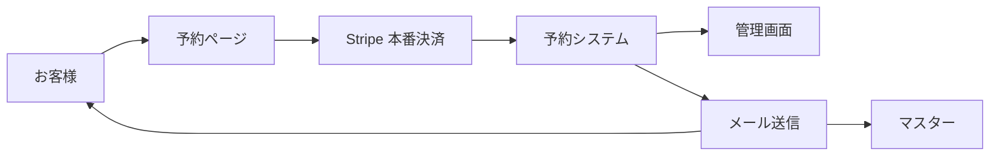
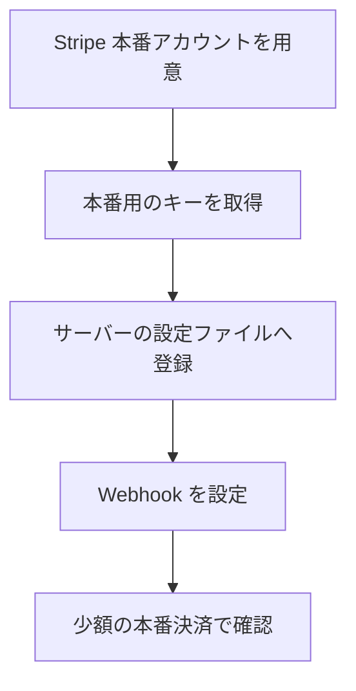
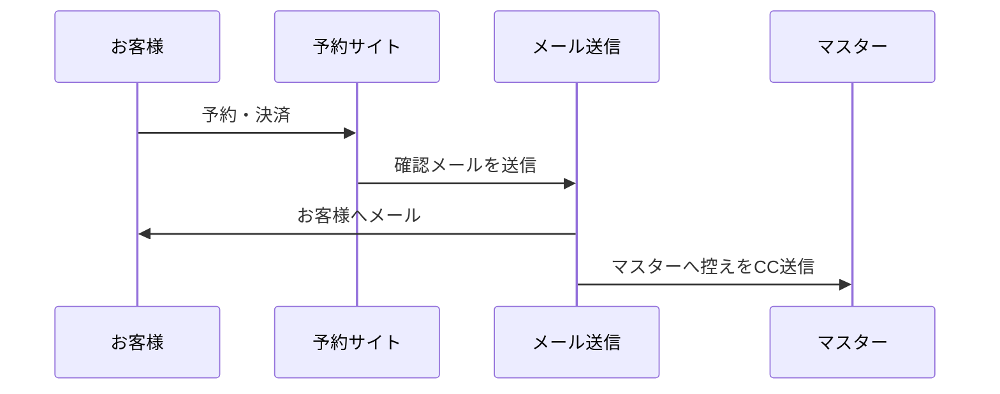
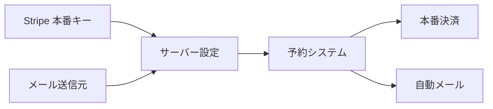
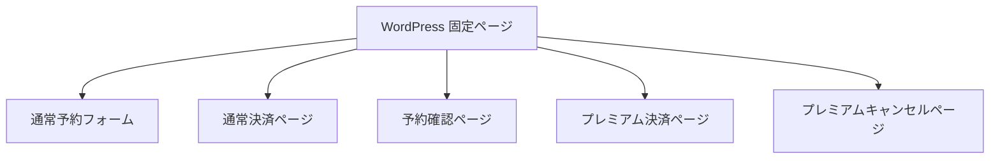
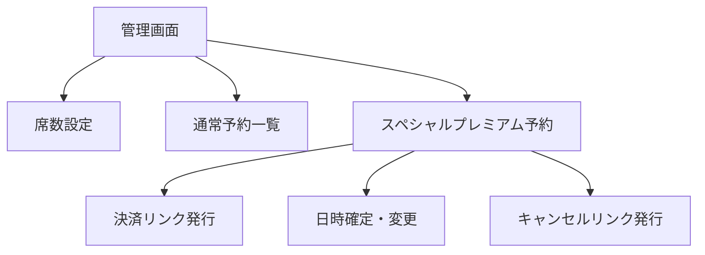
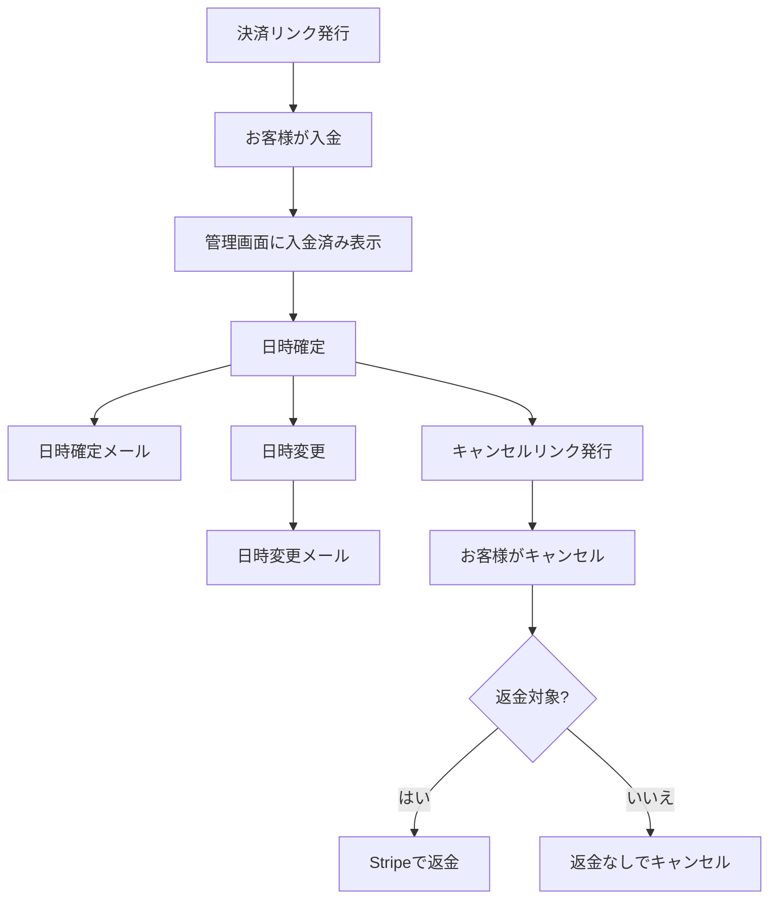
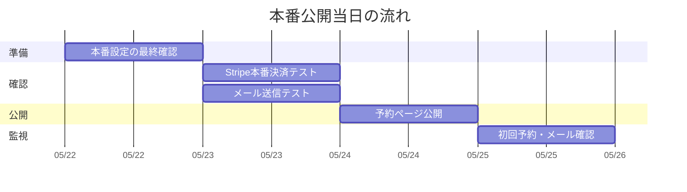

# 本番公開前にやること

この資料は、キチキチ決済予約システムを本番環境で安全に動かすために、公開前に必要な作業をまとめたものです。

特に重要なのは次の2つです。

- お客様へメールが正しく届くようにすること
- Stripe の本番決済アカウントで実際の支払いを受け取れるようにすること

## 全体像

本番公開では、予約システムそのものだけでなく、決済、メール、Webサイトのページ、管理画面の設定がつながっている必要があります。



## 1. Stripe 本番環境の準備

Stripe は、テスト用と本番用で鍵が分かれています。
本番公開時には、テスト用の鍵ではなく、本番用の鍵を設定します。

### 必要なもの

- Stripe 本番アカウント
- 本番用の公開可能キー
- 本番用のシークレットキー
- 本番用の Webhook 署名シークレット
- 本番決済の受取口座設定



### 先方への説明例

> Stripeには練習用の決済モードと、実際にお金を受け取る本番モードがあります。  
> 公開前に、本番モードの設定へ切り替えます。  
> そのあと、実際に少額の決済を行い、入金・予約反映・メール送信がすべて動くか確認します。

## 2. メール送信の準備

予約システムでは、次のタイミングでメールを送ります。

- 通常予約の決済完了時
- 通常予約のキャンセル時
- スペシャルプレミアム予約の入金完了時
- スペシャルプレミアム予約の日時確定時
- スペシャルプレミアム予約の日時変更時
- スペシャルプレミアム予約のキャンセル完了時



### 必要なもの

- 送信元メールアドレス
- 送信元表示名
- 本番サーバーでメール送信できる設定
- 迷惑メールに入りにくくするためのドメイン設定

### 先方への説明例

> 予約が入った時や日時が決まった時に、お客様とマスターへ自動メールが届きます。  
> 本番公開前に、実際のメールアドレスから送れるように設定します。  
> また、迷惑メールに入りにくくするため、メール用のドメイン設定も確認します。

## 3. サーバー側に設定する値

本番サーバーには、次の値を設定します。
これらは管理画面に表示しない秘密情報です。

```text
KKPAY_STRIPE_PUBLISHABLE_KEY=Stripe本番の公開可能キー
KKPAY_STRIPE_SECRET_KEY=Stripe本番のシークレットキー
KKPAY_STRIPE_WEBHOOK_SECRET=Stripe本番Webhookの署名シークレット
KKPAY_FROM_EMAIL=送信元メールアドレス
KKPAY_FROM_NAME=送信元表示名
```



## 4. WordPress 側で作るページ

本番サイトには、次のショートコードを置いたページが必要です。

| 用途 | ショートコード |
| --- | --- |
| 通常予約フォーム | `[kkpay_reservation_form]` |
| 通常予約の決済ページ | `[kkpay_payment_page]` |
| 予約確認・キャンセルページ | `[kkpay_my_reservation]` |
| スペシャルプレミアム決済ページ | `[kkpay_premium_payment]` |
| スペシャルプレミアムキャンセルページ | `[kkpay_premium_cancel]` |



## 5. 管理画面で確認すること

管理画面では、次を確認します。

- 席数設定が2か月後の月末まで表示されること
- 営業日ごとに席数を保存できること
- 通常予約が一覧に表示されること
- スペシャルプレミアム予約タブが表示されること
- プレミアム決済リンクを発行できること
- プレミアム予約の日時確定・日時変更ができること
- キャンセルリンクを発行できること



## 6. 本番公開前テスト

公開前に、必ず本番環境で実際の流れを確認します。

### 通常予約の確認

1. お客様画面から通常予約を入れる
2. Stripe で決済する
3. 予約一覧に表示される
4. お客様へメールが届く
5. マスターにも控えが届く
6. キャンセルできる

### スペシャルプレミアム予約の確認

1. 管理画面で決済リンクを発行する
2. お客様画面で名前、メールアドレス、席数を入力する
3. Stripe で決済する
4. 管理画面で日時を確定する
5. お客様へ日時確定メールが届く
6. 管理画面で日時変更する
7. お客様へ日時変更メールが届く
8. キャンセルリンクを発行する
9. お客様がキャンセルできる
10. 返金対象の場合に Stripe で返金される



## 7. 公開当日の流れ

公開当日は、次の順番で進めると安全です。



## 8. 先方にお願いすること

先方には、次の情報を用意してもらいます。

- Stripe 本番アカウントにログインできる状態
- 売上を受け取る銀行口座の設定
- 予約メールの送信元にしたいメールアドレス
- メールの送信者名
- 本番公開前にテスト決済を行う了承
- テスト用に使う実際のメールアドレス

## 9. 注意点

- Stripe の本番キーは外部に共有しない
- テスト用 Stripe キーのまま公開しない
- メールが迷惑メールに入らないか確認する
- 本番決済テストでは実際にお金が動く
- テスト決済後に必要であれば Stripe 管理画面から返金する
- 公開直後は、予約、決済、メールが正しく動いているか必ず確認する

## 最終チェックリスト

- [ ] Stripe 本番アカウントの準備が完了している
- [ ] Stripe 本番キーをサーバーに設定した
- [ ] Stripe Webhook を本番URLに設定した
- [ ] 送信元メールアドレスを設定した
- [ ] メールが迷惑メールに入らないか確認した
- [ ] WordPress に必要な固定ページを作成した
- [ ] 通常予約の本番テストを行った
- [ ] スペシャルプレミアム予約の本番テストを行った
- [ ] 管理画面で予約一覧と席数設定を確認した
- [ ] 公開後に初回予約を確認する担当者を決めた

