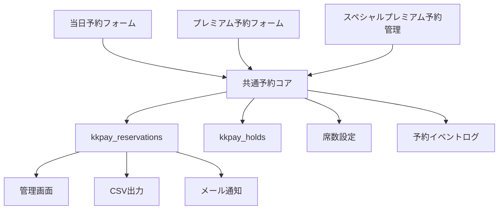
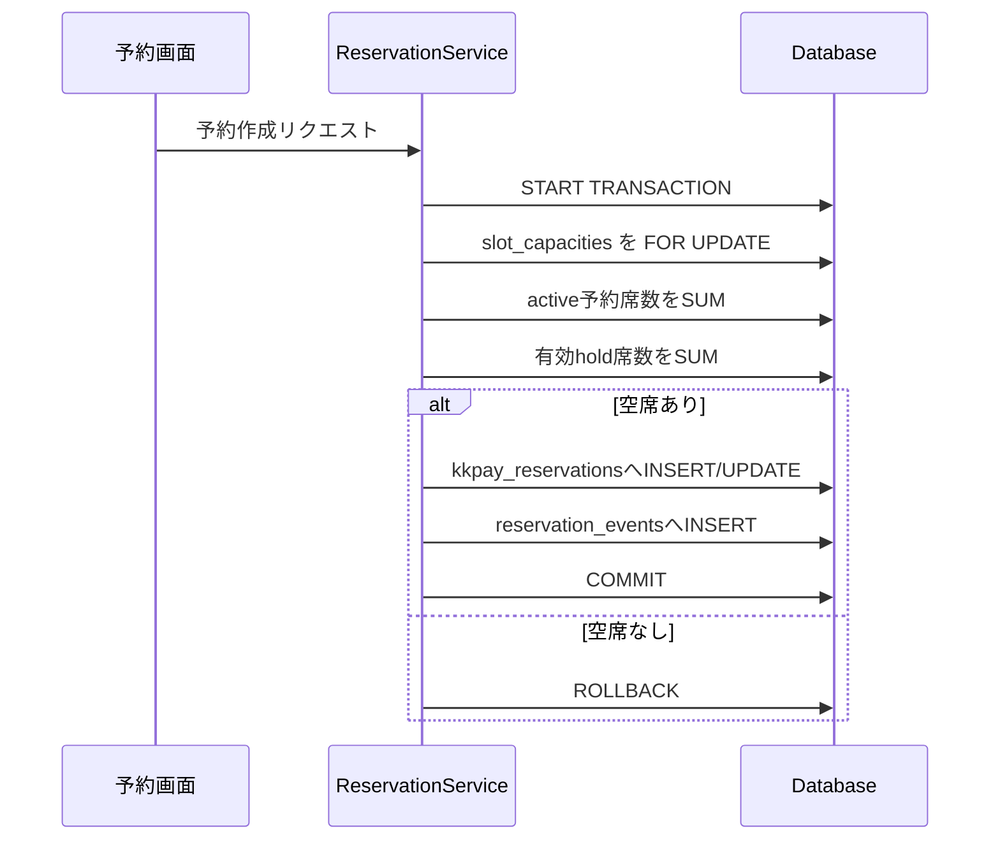
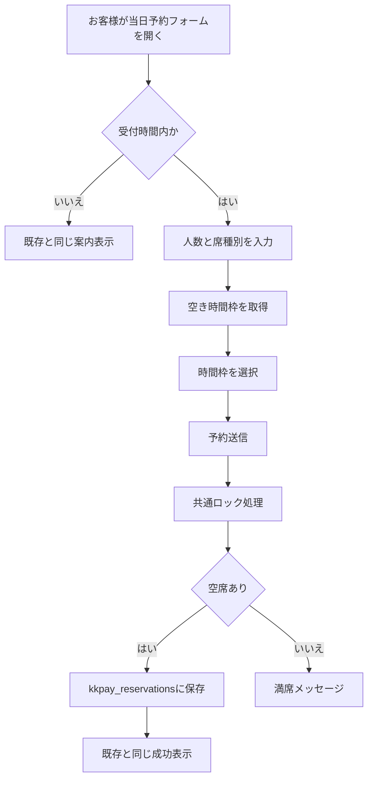
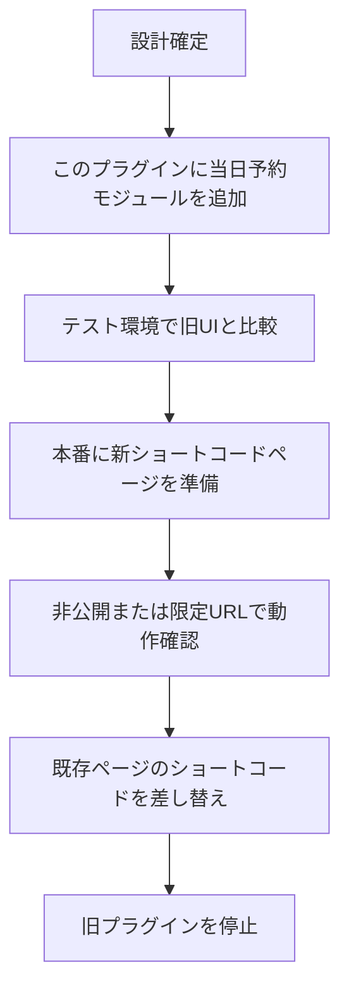
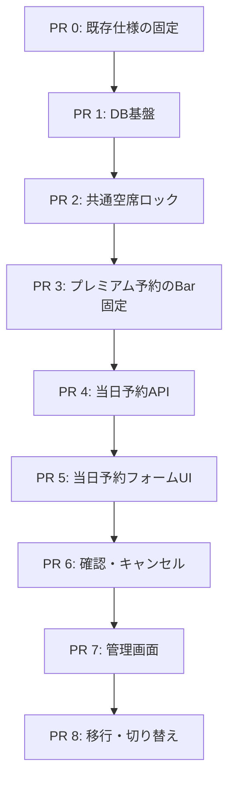

# 当日予約統合設計書

## 目的

既存の当日予約システムで評価されている画面の見え方・操作感をできるだけ維持しながら、通常のプレミアム予約、スペシャルプレミアム予約、当日予約を同じ予約基盤で管理する。

主な目的は次の3点である。

- 当日予約、プレミアム予約、スペシャルプレミアム予約のバッティングを防ぐ。
- 予約データを削除せず、履歴として安全に残す。
- 既存の当日予約UI/UXを踏襲し、運用中の現場に大きな混乱を起こさない。

## 用語定義

| 用語 | 意味 |
| --- | --- |
| 当日予約 | 当日にお客様が空き枠を選んで予約する予約。席種別は `Table` / `Bar` を選択する。 |
| プレミアム予約 | 当日予約以外の通常の事前予約。席種別は強制で `Bar`。 |
| スペシャルプレミアム予約 | マスターが決済リンクを発行し、入金後に日時を確定する特別な予約。席種別は強制で `Bar`。 |
| 予約本体 | 実際に席数を消費する予約データ。統合後は `kkpay_reservations` に集約する。 |
| 既存当日予約プラグイン | `kichikichi-reservation-system`。現在運用中の当日予約システム。 |

## 前提

- 既存当日予約システムのUI/UXは大きく変えない。
- 当日予約データはリセットしない。
- キャンセルは物理削除ではなく、ステータス更新で履歴を残す。
- プレミアム予約とスペシャルプレミアム予約は、どちらも `Bar` として席を消費する。
- バッティング防止のため、予約作成・日時変更・キャンセルは共通の予約ロジックを通す。

## 統合後の全体像



統合後は、予約枠を消費するデータをすべて `kkpay_reservations` に保存する。  
既存当日予約プラグインの `kichikichi_reservation_customer` は、最終的には使用しない。

## UI/UX方針

当日予約の画面は、既存の利用者が慣れている流れを維持する。

### 踏襲するもの

- 言語選択
- 名前、メールアドレス、人数入力
- `Table` / `Bar` の席種別選択
- 予約可能な時間枠だけを選ばせる挙動
- 受付開始前の案内表示
- 満席時の案内表示
- 予約確認ページ
- キャンセルページ
- 管理者側の当日予約一覧
- 管理者側の受付開始操作
- 管理者側の営業日カレンダーの見え方

### 変えるもの

画面上の見え方はできるだけ維持するが、内部処理は変更する。

| 項目 | 現在 | 統合後 |
| --- | --- | --- |
| 当日予約の保存先 | `kichikichi_reservation_customer` | `kkpay_reservations` |
| 当日予約のキャンセル | レコード削除 | `status = cancelled` / `cancelled_at` 更新 |
| 空席判定 | 当日予約テーブルのみ参照 | 共通予約テーブルを参照 |
| 予約履歴 | 日次削除前提 | 永続保存 |
| バッティング防止 | 個別ロジック | 共通ロック処理 |

## 予約種別

`kkpay_reservations.reservation_type` で予約種別を管理する。

| 値 | 意味 | 席種別 |
| --- | --- | --- |
| `same_day` | 当日予約 | `Table` または `Bar` |
| `premium` | プレミアム予約 | `Bar` 固定 |
| `special_premium` | スペシャルプレミアム予約 | `Bar` 固定 |

## データベース設計

### `kkpay_reservations`

全予約の正テーブルとする。既存テーブルにカラムを追加する。

| カラム | 型 | 内容 |
| --- | --- | --- |
| `id` | BIGINT UNSIGNED | 主キー |
| `reservation_type` | VARCHAR(30) | `same_day`, `premium`, `special_premium` |
| `status` | VARCHAR(30) | `active`, `cancelled`, `no_show`, `voided` |
| `reservation_date` | DATE | 予約日 |
| `time_slot` | VARCHAR(20) | `slot_1` から `slot_6` |
| `seating_preference` | VARCHAR(20) | `Table`, `Bar`, `NULL` |
| `number_of_people` | TINYINT UNSIGNED | 席数 |
| `name` | VARCHAR(100) | 名前 |
| `email` | VARCHAR(200) | メールアドレス |
| `email_hash` | CHAR(64) | 検索・照合用メールハッシュ |
| `language` | VARCHAR(10) | 言語 |
| `payment_status` | VARCHAR(30) | `not_required`, `pending`, `paid`, `refunded` |
| `amount` | INT UNSIGNED | 支払額 |
| `currency` | VARCHAR(3) | 通貨 |
| `stripe_payment_intent_id` | VARCHAR(255) | Stripe PaymentIntent ID |
| `stripe_charge_id` | VARCHAR(255) | Stripe Charge ID |
| `cancelled_at` | DATETIME NULL | キャンセル日時 |
| `cancel_reason` | VARCHAR(255) NULL | キャンセル理由 |
| `created_ip_hash` | CHAR(64) NULL | 作成元IPのハッシュ |
| `user_agent_hash` | CHAR(64) NULL | User-Agentのハッシュ |
| `admin_note` | TEXT NULL | 管理者メモ |
| `created_at` | DATETIME | 作成日時 |
| `updated_at` | DATETIME | 更新日時 |

推奨インデックス:

```sql
KEY date_slot_seat_status (reservation_date, time_slot, seating_preference, status),
KEY reservation_type (reservation_type),
KEY email_hash (email_hash),
KEY payment_intent (stripe_payment_intent_id(191))
```

既存の `kkpay_reservations` には `UNIQUE KEY email_date_slot (email, reservation_date, time_slot)` が存在する。
当日予約統合後も、同じメールアドレスが同じ日・同じ時間枠に複数予約することは許可しない方針とするため、このUNIQUE制約は原則維持する。

ただし、`seating_preference` を含めた別制約に変更したい場合、`dbDelta()` だけでは既存UNIQUE KEYの削除・再作成を安全に扱えない。
そのため、PR 1では次のどちらかを明示的に選ぶ。

- 推奨: `email_date_slot` を維持し、同一メール・同一日・同一枠では `Table` と `Bar` の二重予約も禁止する。
- 代替: `UNIQUE KEY email_date_slot_seat (email, reservation_date, time_slot, seating_preference)` に変更する。この場合は `ALTER TABLE DROP INDEX` と `ADD UNIQUE KEY` の明示的なマイグレーションを用意する。

### `kkpay_slot_capacities`

当日予約とプレミアム予約の空席判定で共通利用する席数設定テーブル。  
予約作成時のロック対象にもする。

| カラム | 型 | 内容 |
| --- | --- | --- |
| `id` | BIGINT UNSIGNED | 主キー |
| `capacity_date` | DATE | 対象日 |
| `time_slot` | VARCHAR(20) | `slot_1` から `slot_6` |
| `seating_preference` | VARCHAR(20) | `Table` または `Bar` |
| `capacity` | TINYINT UNSIGNED | 予約可能席数 |
| `enabled` | TINYINT(1) | 受付可否 |
| `created_at` | DATETIME | 作成日時 |
| `updated_at` | DATETIME | 更新日時 |

制約:

```sql
UNIQUE KEY date_slot_seat (capacity_date, time_slot, seating_preference)
```

このテーブルの対象行を `SELECT ... FOR UPDATE` でロックする。  
予約がまだ0件の枠でもロック対象行が存在するため、同時予約に強い。

### `kkpay_reservation_events`

予約操作の監査ログ。予約データを削除しない前提のため、誰が何をしたかを追えるようにする。

| カラム | 型 | 内容 |
| --- | --- | --- |
| `id` | BIGINT UNSIGNED | 主キー |
| `reservation_id` | BIGINT UNSIGNED | 対象予約ID |
| `event_type` | VARCHAR(50) | `reservation_created`, `reservation_rescheduled`, `reservation_cancelled`, `reservation_refunded`, `reservation_no_show`, `reservation_masked` など |
| `actor_type` | VARCHAR(20) | `customer`, `admin`, `system`, `stripe` |
| `actor_id` | BIGINT UNSIGNED NULL | 管理者ユーザーIDなど |
| `event_payload` | LONGTEXT | JSON文字列として保存する操作内容 |
| `ip_hash` | CHAR(64) NULL | IPハッシュ |
| `user_agent_hash` | CHAR(64) NULL | User-Agentハッシュ |
| `created_at` | DATETIME | 作成日時 |

`event_payload` は MySQL / MariaDB の環境差を避けるため、JSON型ではなく `LONGTEXT` に固定する。
保存時は `wp_json_encode()`、読み取り時は `json_decode()` を使い、アプリケーション側で配列として扱う。

### 既存 `kkpay_accepted_dates` の扱い

既存の有料予約プラグインには、営業日・時間枠ごとの受付可否と席数を扱う `kkpay_accepted_dates` が存在する。
統合後は `Table` / `Bar` を分けて残席を管理する必要があるため、席数管理の正本は新設する `kkpay_slot_capacities` に移す。

PR 1では次の方針で移行する。

- `kkpay_slot_capacities` を新規作成する。
- 既存の `kkpay_accepted_dates` の営業枠・席数は `seating_preference = 'Bar'` として `kkpay_slot_capacities` に移行する。
- `Table` の初期席数は `0` とし、管理者が明示的に設定するまで当日予約のTable受付は開始しない。
- プレミアム予約とスペシャルプレミアム予約は、移行後も強制的に `Bar` として扱う。
- `kkpay_accepted_dates` は互換性確認のため当面は残すが、新規実装の書き込み先にはしない。
- 既存の「プレミアムモード判定」は、`kkpay_slot_capacities.enabled` と営業枠の有無に置き換える。

`kkpay_accepted_dates` の削除はこの統合PR群には含めない。

Step 8 時点では `KKPAY_Calendar_Service` など既存読み取り経路がまだ `kkpay_accepted_dates` を参照するため、`Bar` の席数・enabled だけを互換ミラーとして一時的に書き戻す。席数管理の正本は `kkpay_slot_capacities` とし、この互換ミラーは PR 9 の本番切り替え準備で外す。
削除する場合は、運用切替後に別PRで影響確認とデータ退避を行う。

### 既存 `kkpay_cancellations` の扱い

現行の有料予約キャンセル処理では、返金情報を含む監査データを `kkpay_cancellations` に保存している。
統合後も既存の返金履歴を壊さないため、`kkpay_cancellations` は継続利用する。

役割は次のように分ける。

- `kkpay_cancellations`: 既存の有料予約・プレミアム予約のキャンセル返金履歴を保持する。
- `kkpay_reservation_events`: 全予約タイプ共通の操作履歴を保持する。
- 当日予約のキャンセルは返金を伴わないため、`kkpay_cancellations` には書かず、`kkpay_reservation_events` に `reservation_cancelled` イベントを記録する。

将来的に `kkpay_cancellations` を `kkpay_reservation_events` に統合する場合は、`refund_status`、`refund_amount`、`stripe_refund_id` の移行設計を別PRで扱う。

### 既存レコードの `seating_preference` バックフィル

`kkpay_reservations` に `seating_preference` を追加した直後、既存レコードは `NULL` になりうる。
プレミアム予約とスペシャルプレミアム予約はどちらも `Bar` 固定のため、PR 1のマイグレーションで既存の `kkpay_reservations.seating_preference IS NULL` の行を `Bar` に更新する。

アプリケーション側で `NULL` を暗黙に `Bar` と解釈し続ける設計にはしない。
移行後の新規作成・日時変更・当日予約作成では、必ず `seating_preference` を明示して保存する。

## バッティング防止設計

予約作成、プレミアム予約の日時確定、日時変更は、必ず共通の空席ロック処理を通す。



残席計算:

```text
残席 =
  kkpay_slot_capacities.capacity
  - activeな予約の number_of_people 合計
  - 有効な hold の number_of_people 合計
```

対象予約:

```sql
WHERE reservation_date = ?
  AND time_slot = ?
  AND seating_preference = ?
  AND status = 'active'
  AND cancelled_at IS NULL
```

プレミアム予約とスペシャルプレミアム予約は `seating_preference = 'Bar'` として計算する。

## 当日予約フロー



UI上は既存の当日予約フォームに近い見え方にする。  
内部では `kichikichi_reservation_customer` ではなく `kkpay_reservations` に保存する。

## プレミアム予約フロー

プレミアム予約は、日時確定時または日時変更時に `Bar` として空席チェックを行う。

```text
reservation_type = premium
seating_preference = Bar
payment_status = paid
status = active
```

## スペシャルプレミアム予約フロー

決済リンク発行、入金、日時確定、キャンセルリンク発行のUIは既存実装を維持する。

日時確定時に、共通予約コアで `Bar` として空席チェックを行う。

```text
reservation_type = special_premium
seating_preference = Bar
payment_status = paid
status = active
```

## 管理画面設計

既存の管理画面の使い勝手を維持しつつ、内部データは統合する。

### タブ構成案

- 予約一覧
- スペシャルプレミアム予約
- 当日予約
- 席数設定
- 営業日カレンダー

### 当日予約タブ

既存当日予約プラグインの一覧に近い形にする。

- 時間枠ごとにグルーピング
- 名前
- メールアドレス
- 席種別
- 人数
- 合計人数
- キャンセル状態

表示対象は `reservation_type = same_day` かつ対象日で絞る。  
過去日も検索できるようにするが、初期表示は今日にする。

## セキュリティ設計

リセットなしで個人情報を保存するため、次を実装方針に含める。

### 1. 物理削除しない

予約データは削除せず、状態を更新する。

```text
active -> cancelled
active -> no_show
active -> voided
```

### 2. メールハッシュを保存する

メールアドレス検索・照合用に `email_hash` を保存する。  
平文メールは通知や管理表示に必要だが、照合はハッシュで行えるようにする。

### 3. トークンはハッシュ保存に寄せる

今後の改善として、キャンセルリンクや決済リンクのトークンはDBに平文保存せず、ハッシュで保存する。

```text
URL: 生トークン
DB: hash_hmacしたトークン
照合: URLトークンをハッシュ化して比較
```

### 4. 監査ログを残す

予約作成、日時変更、キャンセル、返金、個人情報マスキングなどを `kkpay_reservation_events` に残す。

### 5. 個人情報マスキング

長期保存に備えて、管理者が古い予約の個人情報をマスキングできるようにする。

例:

```text
name = Deleted Customer
email = masked@example.invalid
email_hash = 残す
```

予約日、時間枠、席数、予約種別は統計用に残す。

## 移行方針

既存当日予約システムは運用中のため、一気に置き換えない。



### 移行時に残すもの

- 既存当日予約プラグインの画面構成
- 既存の文言
- 既存の多言語表示
- 既存の受付開始操作に近い運用

### 移行時に変えるもの

- DB保存先
- 空席判定
- キャンセル処理
- 管理画面データ参照先

## 新規ファイル案

```text
includes/Controllers/class-kkpay-same-day-reservation-controller.php
includes/Validators/class-kkpay-same-day-reservation-validator.php
includes/Services/class-kkpay-same-day-reservation-service.php
includes/Repositories/class-kkpay-slot-capacity-repository.php
includes/Repositories/class-kkpay-reservation-event-repository.php

templates/same-day-reservation-form.php
templates/same-day-confirmation.php
templates/admin/same-day-reservations-tab.php

assets/js/kkpay-same-day.js
assets/js/kkpay-admin-same-day.js
```

## ショートコード案

```text
[kkpay_same_day_reservation_form]
[kkpay_same_day_confirmation]
```

既存ページの差し替えを簡単にするため、旧ショートコード名に近い名前を用意してもよい。

## レビュアにやさしい実装手順

実装は、1つのPRで全体を入れず、機能単位で小さく分ける。  
各PRは「DBだけ」「共通ロジックだけ」「当日予約フォームだけ」のように、レビュー対象が明確になる粒度にする。



### PR 0: 既存当日予約仕様の固定

目的: 実装前に、既存当日予約プラグインの挙動を読み取ってテスト可能な仕様として固定する。

作成ドキュメント:

- `doc/15_same_day_reservation_current_spec.md`

変更対象:

- ドキュメントのみ
- 必要であれば既存当日予約プラグインの調査メモ

含める内容:

- 受付開始ボタンの動作
- 受付可能時間
- 昼枠・夜枠の切り替え
- `Table` / `Bar` の席数判定
- 多言語文言
- 確認ページ・キャンセルページの流れ
- 管理画面の当日予約一覧の見え方

レビュー観点:

- 既存運用と認識がずれていないか
- UI/UXとして残すもの・変えるものが明確か

このPRではコードを変更しない。  
以降のPRで「既存仕様から変わったか」を判断できる基準にする。

### PR 1: DB基盤とマイグレーション

目的: 予約データを削除せずに保持し、当日予約・プレミアム予約・スペシャルプレミアム予約を同じ予約台帳で扱えるようにする。

変更対象:

- `includes/class-kkpay-activator.php`
- 新規Repository
- DBスキーマドキュメント

実装内容:

- `kkpay_reservations` に以下のカラムを追加する。
  - `reservation_type`
  - `status`
  - `seating_preference`
  - `email_hash`
  - `currency`
  - `cancel_reason`
  - `created_ip_hash`
  - `user_agent_hash`
  - `admin_note`
  - `updated_at`
- `kkpay_slot_capacities` を追加する。
- `kkpay_reservation_events` を追加する。
- 既存インストールでも `dbDelta()` が走るようにする。
- `event_payload` は `LONGTEXT` として作成し、JSON文字列を保存する。
- 既存の `kkpay_accepted_dates` から `kkpay_slot_capacities` へ営業枠・席数を移行する。
  - 既存値は `seating_preference = 'Bar'` として移行する。
  - `Table` は初期値 `0` とし、管理画面で明示設定されるまで受付対象にしない。
- 既存の `kkpay_reservations.seating_preference IS NULL` の行を `Bar` にバックフィルする。
- 既存の `UNIQUE KEY email_date_slot (email, reservation_date, time_slot)` は維持する。
  - 同一メール・同一日・同一時間枠では、`Table` と `Bar` の二重予約も禁止する。
  - 将来この制約を変える場合は、`dbDelta()` ではなく明示的な `ALTER TABLE DROP INDEX` / `ADD UNIQUE KEY` を別途用意する。
- `kkpay_cancellations` は既存の返金履歴用に残し、今回追加する `kkpay_reservation_events` は共通操作ログとして追加する。

含めないもの:

- 当日予約フォーム
- 管理画面UI
- プレミアム予約の挙動変更
- `kkpay_accepted_dates` の削除
- `kkpay_cancellations` の統合・廃止

レビュー観点:

- 既存データを壊さないか
- `dbDelta()` で既存環境に安全に適用できるか
- インデックスが残席計算・検索に足りているか
- 予約データを物理削除しない前提になっているか
- `kkpay_accepted_dates` から `kkpay_slot_capacities` への移行で、既存のBar席数が失われないか
- `email_date_slot` UNIQUE制約を維持する判断が、業務ルールと一致しているか
- `kkpay_cancellations` と `kkpay_reservation_events` の役割が重複していないか
- `seating_preference` のバックフィル後に、NULLのまま残る有効予約がないか
- `event_payload` が `LONGTEXT` のJSON文字列として一貫して扱われているか

テスト観点:

- 新規インストールでテーブルが作成される
- 既存インストールで不足カラム・不足テーブルが追加される
- 既存の通常予約・スペシャルプレミアム予約が壊れない
- 既存の `kkpay_accepted_dates` のBar席数が `kkpay_slot_capacities` に移行される
- `Table` 初期席数が意図せず受付可能にならない
- 既存予約の `seating_preference` が `Bar` にバックフィルされる
- 同一メール・同一日・同一時間枠の二重予約が引き続きDB制約で防止される

### PR 2: 共通空席ロックサービス

目的: 予約入口ごとの個別判定をやめ、同じロック処理でバッティングを防ぐ。

変更対象:

- `includes/Services/class-kkpay-reservation-service.php`
- `includes/Repositories/class-kkpay-reservation-repository.php`
- `includes/Repositories/class-kkpay-slot-capacity-repository.php`
- `includes/Repositories/class-kkpay-reservation-event-repository.php`

実装内容:

- `capacity_date + time_slot + seating_preference` の行を `SELECT ... FOR UPDATE` でロックする。
- ロック後に active 予約席数を再計算する。
- 有効な hold の席数も計算に含める。
- 空席がある場合だけ予約作成・日時変更を許可する。
- 予約作成・日時変更・キャンセルをイベントログに残す。

含めないもの:

- 当日予約UI
- 当日予約管理画面

レビュー観点:

- トランザクション境界が明確か
- ロック対象が「予約行」ではなく「席数設定行」になっているか
- 予約0件の枠でもロックできるか
- キャンセル済み予約が残席計算から除外されるか

テスト観点:

- 空席がある場合は予約できる
- 満席の場合は予約できない
- 同時予約で上限を超えない
- キャンセル後は残席が戻る

### PR 3: プレミアム予約・スペシャルプレミアム予約の `Bar` 固定化

目的: 当日予約と事前予約のバッティングを防ぐため、当日予約以外を `Bar` として共通残席計算に参加させる。

変更対象:

- プレミアム予約の予約作成処理
- スペシャルプレミアム予約の日時確定・日時変更処理
- CSV出力
- 管理画面表示

実装内容:

- プレミアム予約は `reservation_type = premium` とする。
- スペシャルプレミアム予約は `reservation_type = special_premium` とする。
- どちらも `seating_preference = Bar` 固定にする。
- 日時確定・日時変更時にPR 2の共通空席ロックサービスを使う。

含めないもの:

- 当日予約フォーム
- 既存当日予約プラグインの置き換え

レビュー観点:

- 既存のスペシャルプレミアム予約フローが壊れていないか
- 事前予約が `Bar` の席数を消費するか
- 日時変更時に旧枠と新枠の計算が正しいか

テスト観点:

- スペシャルプレミアム予約を日時確定すると `Bar` 残席が減る
- 日時変更すると旧枠の残席が戻り、新枠の残席が減る
- 満席の `Bar` 枠には日時確定できない

### PR 4: 当日予約API

目的: 既存当日予約UIを載せ替える前に、当日予約のサーバー側処理を新基盤で用意する。

変更対象:

- `includes/Controllers/class-kkpay-same-day-reservation-controller.php`
- `includes/Validators/class-kkpay-same-day-reservation-validator.php`
- `includes/Services/class-kkpay-same-day-reservation-service.php`
- Ajaxアクション登録

実装内容:

- 受付開始状態の取得
- 受付開始・停止
- 人数・席種別に応じた空き時間枠取得
- 当日予約作成
- 当日予約確認
- 当日予約キャンセル

保存内容:

```text
reservation_type = same_day
reservation_date = 今日
payment_status = not_required
status = active
seating_preference = Table または Bar
```

含めないもの:

- 新しい画面デザイン
- 既存ページのショートコード差し替え

レビュー観点:

- 入力検証がValidatorに集約されているか
- 予約作成がPR 2の共通空席ロックサービスを通っているか
- キャンセルが物理削除ではなく `status` / `cancelled_at` 更新になっているか
- 既存当日予約プラグインの受付時間ルールと一致しているか

テスト観点:

- 受付前は予約できない
- 受付時間外は予約できない
- 昼時間帯は昼枠のみ返る
- 夜時間帯は夜枠のみ返る
- `Table` / `Bar` それぞれの満席判定が効く

### PR 5: 当日予約フォームUI

目的: 既存当日予約フォームの見え方と使い勝手を踏襲し、新APIにつなぎ替える。

変更対象:

- `templates/same-day-reservation-form.php`
- `assets/js/kkpay-same-day.js`
- CSS
- ショートコード登録

実装内容:

- `[kkpay_same_day_reservation_form]` を追加する。
- 既存UIに近い入力順・表示文言にする。
- 多言語文言を移植する。
- 人数・席種別変更時に空き時間枠を更新する。
- 予約成功時の表示を既存に近づける。

含めないもの:

- 確認ページ
- キャンセルページ
- 管理画面

レビュー観点:

- 既存UIとの差分が必要最小限か
- サーバー側バリデーションに依存せず、最低限のフロント検証があるか
- 表示文言の多言語対応が維持されているか

テスト観点:

- 各言語でフォーム表示が崩れない
- 満席枠が選択肢に出ない
- 予約成功後の案内が既存に近い

### PR 6: 当日予約確認・キャンセルページ

目的: 既存の確認・キャンセル導線を維持しつつ、新しい予約台帳を参照する。

変更対象:

- `templates/same-day-confirmation.php`
- `assets/js/kkpay-same-day-confirmation.js`
- ショートコード登録

実装内容:

- `[kkpay_same_day_confirmation]` を追加する。
- メールアドレスで予約確認できるようにする。
- キャンセル時はレコード削除ではなく `status = cancelled` にする。
- キャンセル後の表示を既存に近づける。

レビュー観点:

- メール照合に `email_hash` を使える構成になっているか
- キャンセル済み予約が再キャンセルできないか
- キャンセル後に残席計算へ戻るか

テスト観点:

- 予約確認ができる
- キャンセルができる
- キャンセル済み予約は空席に戻る
- 既存と近い文言で案内される

### PR 7: 管理画面の当日予約タブ

目的: 既存当日予約管理画面の見え方を踏襲しつつ、データ参照先を `kkpay_reservations` にする。

変更対象:

- `templates/admin/same-day-reservations-tab.php`
- `includes/class-kkpay-admin.php`
- `assets/js/kkpay-admin-same-day.js`

実装内容:

- 当日予約タブを追加する。
- 初期表示は今日の `same_day` 予約にする。
- 時間枠ごとにグルーピングする。
- 合計人数を表示する。
- 過去日の検索を可能にする。
- キャンセル済みも履歴として確認できるようにする。

レビュー観点:

- 既存管理画面の運用に近いか
- IDや内部ステータスなど、不要な情報を出しすぎていないか
- 過去履歴と当日運用が混ざって見づらくなっていないか

テスト観点:

- 今日の当日予約が一覧表示される
- 時間枠ごとの合計人数が正しい
- キャンセル済みが判別できる
- 過去日を検索できる

### PR 8: 席数設定・営業日カレンダーの統合

目的: 既存の営業日カレンダー・席数設定の運用を残しつつ、共通席数テーブルへ接続する。

変更対象:

- 席数設定タブ
- 営業日カレンダー読み取り処理
- `kkpay_slot_capacities` の保存・取得処理

実装内容:

- `Table` / `Bar` 別の席数を保存する。
- 営業していない枠は予約不可にする。
- プレミアム予約用の `Bar` 残席にも同じ設定を使う。
- 既存の表示範囲や運用に合わせる。
- 席数設定の保存時は、表示中の営業スロットを全件送信する前提にする。
- 表示対象の営業スロットが送信されなかった場合は、古い席数を残さず `capacity = 0` / `enabled = 0` として無効化する。

レビュー観点:

- 現場の席数設定手順が複雑になっていないか
- 既存の営業日カレンダーと矛盾しないか
- 未設定日の扱いが明確か
- 保存対象から欠落した営業スロットを無効化する挙動が、UIの全件送信設計と一致しているか

テスト観点:

- `Table` / `Bar` 別に席数を保存できる
- 営業していない枠は予約できない
- プレミアム予約が `Bar` 席を消費する

### PR 9: 本番切り替え準備

目的: 既存運用を止めずに、新しい当日予約へ安全に切り替えられる状態にする。

変更対象:

- 本番切り替え手順書
- 管理者向け確認手順
- 必要であればFeature Flag

実装内容:

- 新ショートコードページを非公開または限定URLで作る。
- 旧当日予約プラグインと新当日予約の動作比較表を作る。
- 切り戻し手順を用意する。
- 旧プラグイン停止前の確認リストを作る。

レビュー観点:

- 先方が手順を読んで理解できるか
- 切り戻しが可能か
- 本番公開前の確認項目が具体的か

テスト観点:

- テスト環境で旧UIと同等の操作ができる
- 本番URL差し替え前に限定ページで確認できる
- 問題発生時に旧ショートコードへ戻せる

## PR分割ルール

- 1 PR につき、原則1つの機能単位にする。
- DB変更とUI変更を同じPRに混ぜない。
- 既存プレミアム予約への影響があるPRでは、既存予約フローのテスト結果を必ず書く。
- 当日予約UIのPRでは、旧画面との差分スクリーンショットを添える。
- バッティング防止に関わるPRでは、満席・同時予約・キャンセル後残席回復の確認結果を書く。
- 本番切り替え前までは、旧当日予約プラグインを停止しない。

## 未決事項

実装前に次を確定する。

- 当日予約の受付開始・終了ルールを現行と完全一致させるか。
- 当日予約の管理画面文言を現行のまま移すか、日本語の文字化けを修正するか。
- 過去予約の個人情報マスキングを自動化するか、管理者操作にするか。
- 旧 `kichikichi_reservation_customer` の既存データを移行対象にするか。
