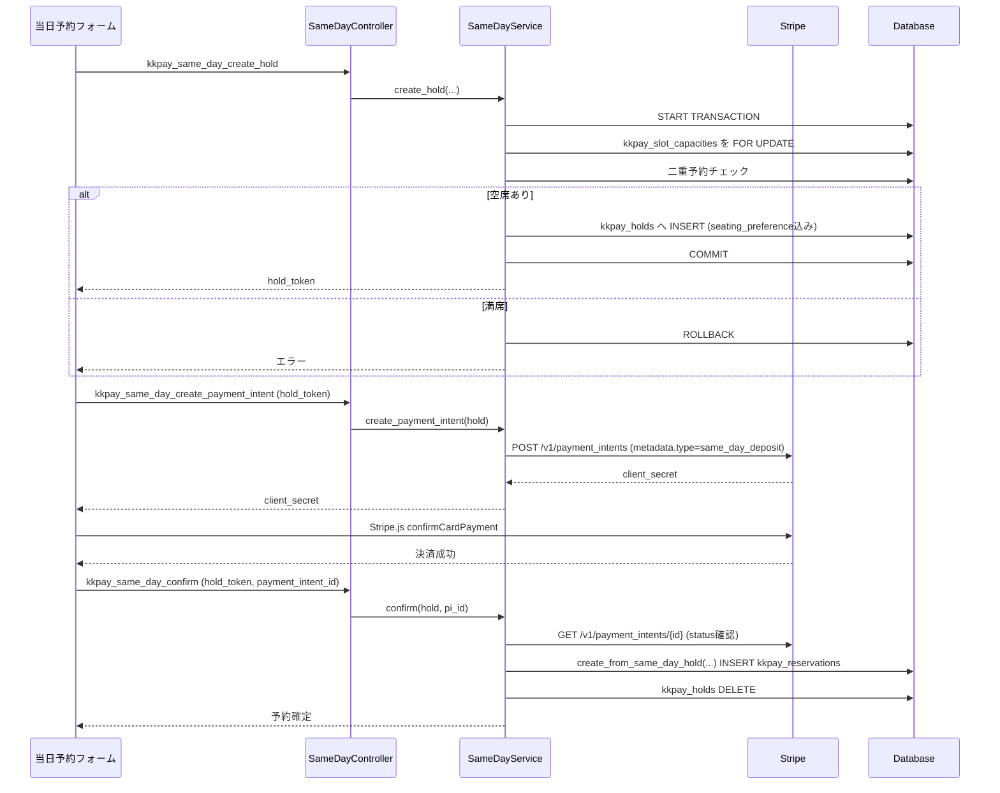
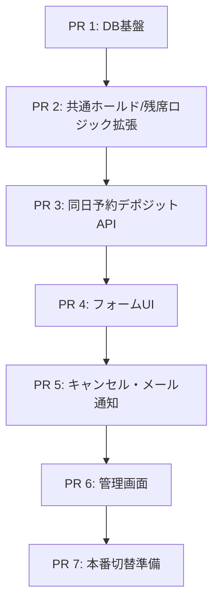

# 当日予約デポジット制設計書

## 目的

現在無料で完了している当日予約を、事前デポジット制に変更する。

- 予約時に USD 13（約2,000円、予約人数＝席数分）を Stripe で決済する。
- デポジットは来店時の料理代金の一部に充当する（当日予約に紐づく残額は店舗で別途会計する）。
- 無断キャンセル・キャンセルのいずれの場合も、デポジットは一切返金しない。
- 変更は当日予約機能に閉じる。プレミアム予約・スペシャルプレミアム予約の挙動・返金ポリシーは変更しない。
- デポジット単価は定数で一元管理し、将来無料運用に戻す場合は定数を `0` に変更するだけで対応できるようにする（[[same-day-deposit-zero-amount]] 参照）。無料時代の実装（`kkpay_same_day_create` 等）はGit履歴に残るため、コードとして復元しておく必要はない。

## デポジットと他の予約種別との違い

| 予約種別 | 支払いの性質 | 来店時の追加会計 | キャンセル時の扱い |
| --- | --- | --- | --- |
| 通常予約（`reservation_type = premium`、AJAX上は「予約」） | 席の予約金。料理代とは別会計 | 通常の飲食代を全額支払う | 返金なし（[[same-day-deposit-cancellation-policy]] と同じ無返金方針） |
| スペシャルプレミアム予約（`reservation_type = special_premium`） | 席の予約金。料理代とは別会計 | 通常の飲食代を全額支払う | 予約日の3日前まで全額返金、それ以降は返金なし |
| **当日予約（デポジット制）** | **料理代の前払い（一部）** | **料理代からデポジット分を差し引いた残額を支払う** | **返金なし（3日前ルールなし、無条件）** |

当日予約デポジットは「席を確保するための予約金」ではなく「注文する料理代金の前払い」である点が、既存2種別との本質的な違いである。この違いはメール文言・フォーム文言・管理画面表示のすべてで明確に伝える必要がある。

## 前提・スコープ

- 触ってよいファイルは当日予約関連ファイル（`*same-day*`）を中心とする。
- 予約基盤共通ファイル（`class-kkpay-reservation-service.php`、`class-kkpay-hold-service.php`、`class-kkpay-capacity-service.php`、`class-kkpay-activator.php`、Webhookディスパッチャ）への変更は、**新規メソッド追加・後方互換のあるカラム追加のみ**に限定し、既存のプレミアム予約・スペシャルプレミアム予約の呼び出し経路・挙動は一切変えない。
- `kkpay_holds` に `seating_preference` カラムがまだ無いことは、既存コード中に3箇所のTODOコメントとして残っている（[[same-day-deposit-hold-seating]] 参照）。今回の実装はこのTODOの解消を含む。
- 返金・キャンセルポリシーは `CLAUDE.md` の「Cancellation Policy」に定める「キャンセルしても返金は行わない」の原則に従う。当日予約デポジットにはスペシャルプレミアム予約のような例外（3日前まで返金）は設けない。

## 現状の当日予約フロー（無料・現行）

実装済みファイル:

- `includes/Controllers/class-kkpay-same-day-reservation-controller.php`
- `includes/Services/class-kkpay-same-day-reservation-service.php`
- `includes/Validators/class-kkpay-same-day-reservation-validator.php`
- `templates/same-day-reservation-form.php` / `assets/js/kkpay-same-day.js`

現行フロー:

```text
1. kkpay_same_day_status         受付状況取得
2. kkpay_same_day_available_slots 人数・席種別に応じた空き枠取得
3. kkpay_same_day_create         即時に kkpay_reservations へ INSERT（payment_status=not_required, amount=0）
4. kkpay_same_day_find           メールで予約照会
5. kkpay_same_day_cancel         status=cancelled に更新（返金なし、ただし決済自体が無いため実質「なし」の返金）
```

`KKPAY_Same_Day_Reservation_Service::create()` は Stripe を一切呼ばず、フォーム送信のその場で予約を確定している（`includes/Services/class-kkpay-same-day-reservation-service.php:62-164`）。

## 変更後の当日予約フロー（デポジット制）

決済が完了するまで席を仮確保する必要があるため、通常予約・プレミアム予約と同様に **ホールド → PaymentIntent作成 → クライアント側決済 → 確定** の3段階フローに変更する。



Webhook（ブラウザが閉じられた場合のフォールバック）は、既存の `payment_intent.succeeded` ディスパッチャに分岐を1つ追加するだけで対応する（[[same-day-deposit-webhook]] 参照）。

上図は `KKPAY_SAME_DAY_DEPOSIT_AMOUNT > 0` の場合のフローである。デポジット額が `0` に設定されている場合（[[same-day-deposit-zero-amount]] 参照）は、`create_payment_intent` / Stripe決済のステップを丸ごとスキップし、ホールド作成後にそのまま `confirm` を呼んで即時確定する。

## 金額設計

新規定数（`early-reservation-system.php` に追加）:

| 定数 | 値 | 用途 |
| --- | --- | --- |
| `KKPAY_SAME_DAY_DEPOSIT_AMOUNT` | 13 | 1名あたりのデポジット額（USD） |
| `KKPAY_SAME_DAY_DEPOSIT_CURRENCY` | `'usd'` | Stripe通貨コード |

デポジット合計額 = `KKPAY_SAME_DAY_DEPOSIT_AMOUNT × number_of_people`（**確定**: 人数分＝席数分。1名1皿を前提に、席数ぶんのデポジットを徴収する）。

既存の `KKPAY_Reservation_Service::calculate_amount()`（`KKPAY_AMOUNT × 人数`）と同じ「1名あたり単価 × 人数」の計算パターンを踏襲する。当日予約専用の計算メソッドとして `KKPAY_Same_Day_Reservation_Service::calculate_deposit_amount( $number_of_people )` を新設し、既存の `calculate_amount()` は変更しない。

## デポジット額を0円にする場合の設計（無料運用への切り戻し）

店主から「13ドルは変数で管理し、いつでも0ドル決済に戻せるようにしたい」という要望があるため、デポジット単価を1箇所の定数（`KKPAY_SAME_DAY_DEPOSIT_AMOUNT`）に集約し、この値を変更するだけで無料運用に戻せる構成にする。無料だった頃の実装（`kkpay_same_day_create` 等）は削除してよい（Gitで管理されており、必要になれば履歴から参照できるため、コードとして残す必要はない）。

ただし単純に定数を `0` にするだけでは、Stripeの仕様上 **USD 0.00 のPaymentIntentは作成できない**（Stripeには最低決済金額の制約がある）。そのため、コード側で次の分岐を必ず持たせる。

```text
deposit_total = KKPAY_SAME_DAY_DEPOSIT_AMOUNT * number_of_people

if deposit_total > 0:
    通常のデポジットフロー（ホールド → PaymentIntent作成 → Stripe決済 → 確定）
else:
    Stripeを一切呼ばない。ホールド作成後、そのまま確定する（payment_status = not_required, amount = 0）
```

この分岐により、`KKPAY_SAME_DAY_DEPOSIT_AMOUNT` を `0` に変更するだけで、コードを一切変更せずに現行の無料即時予約と同じ挙動（Stripeを介さない即時確定）に戻せる。フロントエンドも `kkpay_same_day_status` 等のレスポンスに含める `deposit_amount_per_person` を見て、0円ならカード入力ステップ自体を表示しない。

## データベース設計

### `kkpay_holds` にカラムを追加する

現状 `kkpay_holds` には `seating_preference` が無く、当日予約の残席計算では「ホールドは常に Bar 扱い」という暫定ロジックになっている（`includes/Services/class-kkpay-capacity-service.php:100-104`、`includes/Services/class-kkpay-reservation-service.php:57-59`、`includes/Services/class-kkpay-same-day-reservation-service.php:279-281` のTODOコメント参照）。

デポジット決済中は `Table` 席もホールドで仮確保する必要があるため、このカラムを追加する。

```sql
ALTER TABLE {prefix}kkpay_holds
  ADD COLUMN seating_preference VARCHAR(20) NOT NULL DEFAULT 'Bar' AFTER time_slot;
```

`dbDelta()` は既存テーブルへのカラム追加を検出できるため、`class-kkpay-activator.php` の `CREATE TABLE` 定義に `seating_preference` を追記するだけでよい。デフォルト `'Bar'` により、既存の通常予約・プレミアム予約の呼び出し（`seating_preference` を指定しない）は影響を受けない。

### `kkpay_reservations` はカラム追加不要

`payment_status`、`amount`、`currency`、`stripe_payment_intent_id`、`stripe_charge_id`、`hold_id`、`seating_preference` はすでに存在する（`includes/class-kkpay-activator.php:182` 以降）。当日予約デポジットはこれらを次のように使う。

```text
reservation_type   = same_day        (変更なし)
seating_preference = Table または Bar (変更なし)
payment_status     = pending -> paid  (現状は常に not_required)
amount             = KKPAY_SAME_DAY_DEPOSIT_AMOUNT * number_of_people (現状は常に 0)
stripe_payment_intent_id / stripe_charge_id = 決済情報を記録 (現状は常に NULL)
hold_id            = ホールドから確定した予約のID (現状は使われていない)
```

### `kkpay_cancellations` の扱いを変更する

現行の当日予約キャンセルは無料のため `kkpay_cancellations`（返金監査テーブル）に書き込まず、`kkpay_reservation_events` のみに記録している（`doc/14_same_day_reservation_integration_design.md` の既存方針）。

デポジット制では実際の入金が発生するため、経理・監査の観点から **プレミアム予約と同様に `kkpay_cancellations` にも記録する** ことを推奨する。実装上は、当日予約キャンセルの実装を独自ロジックのままにせず、既存の `KKPAY_Cancellation_Service::cancel( $reservation, $lang )`（`includes/Services/class-kkpay-cancellation-service.php`）をそのまま呼び出す形に寄せる。このサービスは `reservation_type` を汎用的に扱っており、`refund_status = 'none'` / `refund_amount = 0` / `stripe_refund_id = null` を必ず記録するため、当日予約デポジットの「無条件無返金」という要件に完全に合致する。

## API設計（AJAX）

| Action | Controller | 説明 |
| --- | --- | --- |
| `kkpay_same_day_status` | 既存のまま | 変更なし |
| `kkpay_same_day_available_slots` | 既存のまま | 変更なし |
| `kkpay_same_day_create_hold` | 新規 `ajax_create_hold()` | 5分間のホールドを作成し `hold_token` を返す |
| `kkpay_same_day_create_payment_intent` | 新規 `ajax_create_payment_intent()` | ホールドに対応する PaymentIntent を作成し `client_secret` を返す。デポジット額が `0` の場合は呼び出し不要（フロントエンドが判断してスキップする） |
| `kkpay_same_day_confirm` | 新規 `ajax_confirm()` | 決済成功後に予約を確定する（旧 `kkpay_same_day_create` を置き換え）。デポジット額が `0` の場合は `payment_intent_id` 無しで呼び出し、Stripeを介さず即時確定する |
| `kkpay_same_day_find` | 既存のまま | `build_response()` に `amount` / `payment_status` を追加 |
| `kkpay_same_day_cancel` | 既存のまま（内部実装のみ変更） | `KKPAY_Cancellation_Service::cancel()` を呼ぶ形に変更 |

**確定**: 旧 `kkpay_same_day_create`（無料即時予約）のAJAX登録・Controller/Validatorメソッドは削除する。Gitで履歴管理されているため、コードとして残しておく必要はない。無料運用に戻す必要が生じた場合は、旧コードを復元するのではなく `KKPAY_SAME_DAY_DEPOSIT_AMOUNT` を `0` にする（[[same-day-deposit-zero-amount]] 参照）ことで対応する。

### ホールド作成の共有インフラ変更

`KKPAY_Hold_Service::create()` は現在 `seating_preference` を受け取らず、内部で `'Bar'` 固定で `KKPAY_Capacity_Service::check_available_for_update()` を呼んでいる（`includes/Services/class-kkpay-hold-service.php:30`）。

```php
public static function create( $date, $slot, $num, $name, $email, $lang, $seating_preference = 'Bar' ) {
    ...
    $capacity_check = KKPAY_Capacity_Service::check_available_for_update( $date, $slot, $seating_preference, $num );
    ...
    $inserted = KKPAY_Hold_Repository::insert( array(
        ...
        'seating_preference' => $seating_preference,
        ...
    ) );
```

デフォルト引数により、既存の `KKPAY_Hold_Controller::ajax_create_hold()`（通常予約、常に `Bar`）の呼び出しは無変更で動作する。同日予約側は `$data['seating_preference']`（`Table` または `Bar`）を明示的に渡す。

`KKPAY_Capacity_Service::sum_held_people_for_slot_and_seat()` の「`Bar` 以外は0を返す」というハードコードも、`seating_preference` を素直に条件へ渡す形に変更する（`includes/Services/class-kkpay-capacity-service.php:99-107`）。これにより `Table` ホールドも残席計算に反映される。

### 予約確定ロジック

`KKPAY_Payment_Service::confirm()` は `KKPAY_Reservation_Service::create_from_hold()` を呼ぶが、そこでは `reservation_type = 'premium'` が固定で書かれている（`includes/Services/class-kkpay-reservation-service.php:79`）ため、同日予約では使えない。

`KKPAY_Reservation_Service` に新規メソッドを追加する（既存メソッドは変更しない）。

```php
public static function create_from_same_day_hold( $hold, $pi_id, $charge_id, $status ) {
    // create_from_hold() とほぼ同じ構造。
    // reservation_type = 'same_day'
    // seating_preference = $hold->seating_preference
    // amount = KKPAY_Same_Day_Reservation_Service::calculate_deposit_amount( $hold->number_of_people )
}
```

同日予約専用の決済確定処理（`KKPAY_Same_Day_Reservation_Service::confirm()`）は `KKPAY_Payment_Service::confirm()` と同じ構造（PaymentIntent状態確認 → 冪等性チェック → 予約作成 → ホールド削除 → メール送信）を、同日予約サービス内に実装する。

`confirm()` の先頭で `calculate_deposit_amount( $hold->number_of_people ) === 0` を判定し、`0` の場合は `$pi_id` / `$charge_id` を渡さず（`null`）に直接 `create_from_same_day_hold()` を呼んで `payment_status = 'not_required'` で確定する。Stripe API 呼び出し・PaymentIntent状態確認はスキップする（[[same-day-deposit-zero-amount]] 参照）。

## Stripe設計

### PaymentIntent作成

```php
KKPAY_Stripe_Client::request( 'POST', '/v1/payment_intents', array(
    'amount'                             => $stripe_amount, // deposit_amount * 100
    'currency'                           => KKPAY_SAME_DAY_DEPOSIT_CURRENCY,
    'description'                        => 'KichiKichi Same-Day Reservation Deposit',
    'automatic_payment_methods[enabled]' => 'true',
    'metadata[type]'                     => 'same_day_deposit',
    'metadata[hold_token]'               => $hold->hold_token,
    'metadata[reservation_date]'         => $hold->reservation_date,
    'metadata[time_slot]'                => $hold->time_slot,
    'metadata[seating_preference]'       => $hold->seating_preference,
    'metadata[number_of_people]'         => (int) $hold->number_of_people,
    'metadata[unit_amount]'              => KKPAY_SAME_DAY_DEPOSIT_AMOUNT,
    'metadata[email]'                    => $hold->email,
) );
```

### Webhookディスパッチャへの分岐追加

`includes/Controllers/class-kkpay-payment-controller.php:98-115` の `payment_intent.succeeded` 分岐に、`metadata.type === 'premium_reservation'` の分岐と並列で追加する。

```php
if ( ( $object['metadata']['type'] ?? '' ) === 'premium_reservation' ) {
    KKPAY_Premium_Reservation_Service::handle_webhook_payment_intent_succeeded( $object );
} elseif ( ( $object['metadata']['type'] ?? '' ) === 'same_day_deposit' ) {
    KKPAY_Same_Day_Reservation_Service::handle_webhook_payment_intent_succeeded( $object );
} else {
    KKPAY_Payment_Service::handle_payment_intent_succeeded( $object );
}
```

`charge.refunded` 分岐は当日予約デポジットでは発火しない想定（返金APIを一切呼ばないため）。ダッシュボードから手動返金された場合の同期は、既存の `is_premium` 判定と同様に `KKPAY_Reservation_Repository::find_by_payment_intent()` で `reservation_type = 'same_day'` を判定し、`payment_status = 'refunded'` に更新するだけの最小分岐を追加する（実運用上は想定していないが、CLAUDE.mdの「外部返金された場合の同期用」という既存方針に合わせる）。

### 冪等性

`KKPAY_Reservation_Repository::find_by_payment_intent( $pi_id )` による冪等性チェックは既存の `stripe_payment_intent_id` UNIQUE制約とあわせてそのまま再利用できる。AJAX確定・Webhook確定のどちらが先に届いても二重予約は作られない。

## キャンセル・無断キャンセル設計

### キャンセル（顧客操作）

```text
KKPAY_Same_Day_Reservation_Service::cancel( $email, $lang )
  → 対象予約を取得（既存ロジックのまま）
  → KKPAY_Cancellation_Service::cancel( $reservation, $lang ) を呼ぶ
      → kkpay_cancellations へ INSERT (refund_status=none, refund_amount=0, stripe_refund_id=null)
      → kkpay_reservations を status=cancelled に更新
      → kkpay_reservation_events へ INSERT
      → メール送信（デポジット没収の案内）
```

Stripe Refund APIは一切呼ばない。`CLAUDE.md` の「Cancellation Policy」に定める原則をそのまま適用する。

### 無断キャンセル（no-show）

**確定**: no-show を管理画面から明示的にマークする機能は今回のスコープに含めない。デポジット制でも「来店しなかった予約はキャンセルもされず `active` のまま残る」を許容する（`kkpay_reservations.status` には `no_show` の値がすでに定義されているため、将来的な管理画面拡張は容易だが、本設計・以降のPRには含めない）。デポジットは決済時点で確定しているため、no-show でも何もしなければ自動的に「返金されない」状態になる。

### 文言

新規メッセージキー（`includes/kkpay-messages.php`、5言語）:

| キー | 用途 |
| --- | --- |
| `same_day_deposit_notice` | フォーム上部：デポジットの説明（料理代に充当、返金なし） |
| `same_day_deposit_amount_label` | 「デポジット: USD 13/名」等の金額表示 |
| `same_day_deposit_cancel_warning` | キャンセル画面：デポジットは返金されない旨の警告 |
| `same_day_deposit_cancel_success` | キャンセル完了メッセージ（`same_day_cancel_success` を置き換え、返金なし文言を含める） |
| `same_day_deposit_payment_confirmation_subject` 等 | 決済確認メール文言一式 |

既存の `cancel_success_no_refund`（プレミアム予約向け）とは別キーにする。プレミアム予約は「予約金の無返金」、当日予約は「料理代前払いの無返金」であり、意味が異なるため文言も分ける。

### 決済確認メールの内容（確定）

決済確認メール（`KKPAY_Email_Service::send_same_day_deposit_confirmation()`）は、次の3要素を必ず含める。

1. **予約内容の箇条書き** — 日付、時間枠、席種別（`Table`/`Bar`）、人数、デポジット金額（`amount`）、氏名・メールアドレス。
2. **返金なしの明記** — 「お支払いいただいたデポジットは、キャンセル・無断キャンセルを問わず返金されません」という趣旨の文言。
3. **残額店舗払いの明記** — 「当日のお会計時に、ご注文金額からデポジット分を差し引いた残額をお支払いください」という趣旨の文言。デポジットは当システムが把握しない料理単価の一部前払いであり、具体的な残額はシステム側では計算できないため、金額を明示せず「差し引いた残額」という表現に留める。

キャンセル確認メール（`send_same_day_deposit_cancellation()`）にも、上記2・3に相当する「デポジットは返金されない」旨を含める（キャンセル後は残額会計自体が発生しないため、3の文言は不要）。

いずれも5言語（en/ja/ko/zh-CN/zh-TW）分の文言を `includes/kkpay-messages.php` に追加する。

## フロントエンド設計

### `templates/same-day-reservation-form.php`

- 人数・席種別選択後、時間枠選択の下にデポジット金額表示（`same_day_deposit_amount_label`、`number_of_people × KKPAY_SAME_DAY_DEPOSIT_AMOUNT`）を追加する。
- 「予約する」ボタンの前に Stripe Card Element セクションを追加する（`templates/premium-payment.php` の `#kkpay-premium-card-element` と同じパターン）。
- 同意チェックボックス（`#kkpay-same-day-agree-final`）の文言に「デポジットは返金されません」を含める。

### `assets/js/kkpay-same-day.js`

現在の1ステップ送信（`kkpay_same_day_create` 一発呼び出し）を、次の3ステップに変更する（`KKPAY_SAME_DAY_DEPOSIT_AMOUNT > 0` の場合）。

```text
1. 入力内容確定 → kkpay_same_day_create_hold → hold_token 取得
2. kkpay_same_day_create_payment_intent → client_secret 取得 → Stripe Elements マウント
3. カード情報入力 → stripe.confirmCardPayment(client_secret) → 成功
4. kkpay_same_day_confirm(hold_token, payment_intent_id) → 予約確定表示
```

（デポジット額が `0` の場合は、手順2・3をスキップし `kkpay_same_day_create_hold` の直後に `kkpay_same_day_confirm(hold_token)` を呼ぶ2ステップになる。[[same-day-deposit-zero-amount]] 参照。）

**確定**: ホールドの有効期限（`KKPAY_HOLD_MINUTES` = 5分）内にカード決済が完了しなかった場合、ホールドの再作成は行わず、フォーム全体を最初の状態（言語選択後の入力前）からやり直させる。具体的には、既存の `hold_expired` メッセージキーを表示した上で、フォーム内の入力値（名前・メール・人数・席種別・時間枠選択・カード入力）をすべてクリアし、ユーザーに再度フォームの先頭から入力させる。裏側のホールド・PaymentIntentは失効させ、当該 `hold_token` を使い回さない。

### `templates/admin/same-day-reservations-tab.php`

一覧テーブルに以下の列を追加する。

- デポジット金額（`amount`）
- 決済状況（`payment_status`）

`kkpay_reservations` の値をそのまま表示するだけで、集計ロジック（`$totals`）の変更は不要。

## 影響範囲まとめ

### 当日予約専用ファイル（新規・全面変更）

- `includes/Controllers/class-kkpay-same-day-reservation-controller.php`
- `includes/Services/class-kkpay-same-day-reservation-service.php`
- `includes/Validators/class-kkpay-same-day-reservation-validator.php`
- `templates/same-day-reservation-form.php`
- `assets/js/kkpay-same-day.js`
- `templates/admin/same-day-reservations-tab.php`

### 共通ファイル（追加のみ・既存挙動は不変）

| ファイル | 変更内容 | 既存フローへの影響 |
| --- | --- | --- |
| `includes/class-kkpay-activator.php` | `kkpay_holds` に `seating_preference` カラム追加（デフォルト `Bar`） | なし |
| `includes/Services/class-kkpay-hold-service.php` | `create()` に `$seating_preference = 'Bar'` 引数を追加 | なし（デフォルト値で従来通り） |
| `includes/Services/class-kkpay-capacity-service.php` | ホールド集計を `seating_preference` 条件に対応させる | 通常予約・プレミアム予約は常に `Bar` を渡すため計算結果は変わらない |
| `includes/Services/class-kkpay-reservation-service.php` | `create_from_same_day_hold()` を新規追加 | 既存メソッド無変更 |
| `includes/Services/class-kkpay-email-service.php` | 同日予約デポジット向けメール送信メソッドを新規追加 | 既存メソッド無変更 |
| `includes/Controllers/class-kkpay-payment-controller.php` | Webhook分岐に `same_day_deposit` を追加 | 既存分岐（`premium_reservation` / それ以外）は無変更 |
| `includes/kkpay-messages.php` | メッセージキー追加のみ | 既存キー無変更 |
| `early-reservation-system.php` | 定数・AJAX登録の追加 | 既存登録は無変更 |

プレミアム予約・スペシャルプレミアム予約のサービスクラス（`class-kkpay-payment-service.php` の既存メソッド、`class-kkpay-premium-reservation-service.php`）自体は一切変更しない。

## 確定事項（店主確認済み・2026-07-05）

| 論点 | 決定内容 |
| --- | --- |
| デポジット額の単位 | 人数分（＝席数分）。`KKPAY_SAME_DAY_DEPOSIT_AMOUNT × number_of_people`。 |
| 旧 `kkpay_same_day_create`（無料即時予約） | 削除してよい。Gitで履歴管理されているため、コードとして残す必要はない。無料運用に戻す必要が生じた場合は `KKPAY_SAME_DAY_DEPOSIT_AMOUNT` を `0` に変更して対応する（[[same-day-deposit-zero-amount]] 参照）。 |
| no-showの管理画面マーク機能 | スコープに含めない。`active` のまま残り続ける挙動を許容する。 |
| ホールド有効期限切れ時のUI挙動 | ホールドを再作成せず、フォーム全体を最初からやり直させる。 |
| 決済確認メール | 必要。内容は「予約内容の箇条書き」「返金なし」「残額店舗払いの明記」の3点を含める。 |
| `kkpay_holds.seating_preference` 追加後の既存インストール動作確認 | テストコードで対応する（PR 1に自動テストを含める）。 |

これらの決定は本ドキュメントの各設計節・PR分割に反映済み。今後、追加の論点が出た場合はこの表を更新する。

## 実装手順（PR分割）

`doc/14_same_day_reservation_integration_design.md` と同じ方針で、1PR = 1機能単位に分割する。DB変更とUI変更は同じPRに混ぜない。決済に関わるPRは、既存のプレミアム予約フローを壊していないことを必ず確認する。仕様上の論点はすべて「確定事項」節で決着済みのため、仕様確定のためだけのPRは設けない。



### PR 1: DB基盤とマイグレーション

目的: `kkpay_holds` に席種別を持たせ、当日予約のホールドが `Table` / `Bar` を区別できるようにする。あわせてデポジット関連の定数を追加する。

変更対象:

- `includes/class-kkpay-activator.php`
- `early-reservation-system.php`（定数追加のみ）

実装内容:

- `kkpay_holds` に `seating_preference VARCHAR(20) NOT NULL DEFAULT 'Bar'` を追加する（`CREATE TABLE` 定義に追記し、既存インストールには `dbDelta()` でカラム追加させる）。
- `KKPAY_SAME_DAY_DEPOSIT_AMOUNT = 13`、`KKPAY_SAME_DAY_DEPOSIT_CURRENCY = 'usd'` を定数として追加する。
- 既存の `kkpay_holds` インデックス（`hold_token`、`reservation_date_slot`、`expires_at`）は変更しない。
- **マイグレーション確認用の自動テストを追加する**（下記「自動テスト」参照）。`CLAUDE.md` に記載の「No automated tests」からの意図的な例外として、このマイグレーションに限定したテストコードを新設する。

含めないもの:

- `KKPAY_Hold_Service` / `KKPAY_Capacity_Service` のロジック変更（PR 2で行う）。
- 当日予約API・UIの変更。
- このマイグレーション以外を対象にした汎用テストフレームワークの導入。

レビュー観点:

- 既存インストールに対して `dbDelta()` が安全にカラムを追加できるか（`DEFAULT 'Bar'` により既存行・既存INSERTが壊れないか）。
- 新規インストールで最初から `seating_preference` 込みでテーブルが作成されるか。
- 自動テストが「カラム無し状態 → dbDelta実行 → カラムあり状態」の遷移を実際に再現しているか（モックではなく実DBに対して検証しているか）。

自動テスト:

- 当日予約専用の最小限のテストハーネス（例: `tests/migrations/test-kkpay-holds-seating-preference.php`）を追加し、次を検証する。
  - `seating_preference` カラムを持たない状態で `kkpay_holds` を作成する（旧スキーマを再現）。
  - `KKPAY_Activator::activate()`（`dbDelta()` 経由）を実行する。
  - カラムが追加され、型・デフォルト値（`VARCHAR(20) NOT NULL DEFAULT 'Bar'`）が期待通りであることをアサートする。
  - 既存行を1件INSERTしてからカラムを追加し、既存行の `seating_preference` が `Bar` になっていることをアサートする。
- WP-CLI（`wp eval-file`）または最小限のWordPressブートストラップから実行できる形にし、CI手動実行の手順を `doc/` に残す。

テスト項目:

- [ ] PR1-T1（自動）: 新規インストールで `kkpay_holds.seating_preference` が作成される。
- [ ] PR1-T2（自動）: 既存インストール（カラム無し状態）に対して `dbDelta()` 実行でカラムが追加される。
- [ ] PR1-T3（自動）: カラム追加後、既存行の `seating_preference` が `Bar` で埋まっている。
- [ ] PR1-T4（手動）: カラム追加後も、既存の通常予約・プレミアム予約のホールド作成が壊れない（`seating_preference` を渡さないINSERTが `Bar` で入る）。
- [ ] PR1-T5（手動）: `KKPAY_SAME_DAY_DEPOSIT_AMOUNT` / `KKPAY_SAME_DAY_DEPOSIT_CURRENCY` が確定事項の値（13 / usd）と一致している。

### PR 2: 共通ホールド・残席ロジックの後方互換拡張

目的: `KKPAY_Hold_Service` と `KKPAY_Capacity_Service` に `seating_preference` を通せるようにし、`Table` ホールドの残席計算を可能にする。既存呼び出し元（通常予約・プレミアム予約）の挙動は一切変えない。

変更対象:

- `includes/Services/class-kkpay-hold-service.php`
- `includes/Services/class-kkpay-capacity-service.php`
- `includes/Services/class-kkpay-reservation-service.php`
- `includes/Services/class-kkpay-same-day-reservation-service.php`
- `includes/Repositories/class-kkpay-hold-repository.php`（`seating_preference` を含めたINSERT/SELECT対応）

実装内容:

- `KKPAY_Hold_Service::create()` に `$seating_preference = 'Bar'` 引数を追加し、`KKPAY_Capacity_Service::check_available_for_update()` と `KKPAY_Hold_Repository::insert()` にそのまま渡す。
- `KKPAY_Capacity_Service::sum_held_people_for_slot_and_seat()` の「`Bar` 以外は問答無用で0を返す」ハードコードを、`seating_preference` 条件付きのホールド集計に置き換える。
- 表示用残席計算も、ホールド分については席種別条件付き集計へ置き換える。`KKPAY_Reservation_Service::get_remaining_capacity()` は引き続き通常予約向けに `Bar` 固定で計算するが、`Table` ホールドが `Bar` 残席に混入しないようホールド集計だけ `Bar` 条件付きにする。
- `KKPAY_Same_Day_Reservation_Service::remaining_capacity()` の同様のTODOハックも解消し、当日予約の `Table` / `Bar` 表示用残席がそれぞれのホールドだけを反映するようにする。
- `KKPAY_Same_Day_Reservation_Service::calculate_deposit_amount( $number_of_people )` を新規追加する。
- `KKPAY_Reservation_Service` に `create_from_same_day_hold( $hold, $pi_id, $charge_id, $status )` を新規追加する。`create_from_hold()` と同じトランザクション構造で、`reservation_type = 'same_day'`、`seating_preference = $hold->seating_preference`、`amount = KKPAY_Same_Day_Reservation_Service::calculate_deposit_amount( $hold->number_of_people )` を保存する。

含めないもの:

- 当日予約Controller/Validator/APIの変更（PR 3で行う）。
- `KKPAY_Hold_Controller::ajax_create_hold()`（通常予約側の呼び出し元）の変更。デフォルト引数だけで対応できるため触らない。

レビュー観点:

- 既存の通常予約・プレミアム予約の呼び出し（`seating_preference` を渡さない）で計算結果が1件たりとも変わらないこと。
- `Table` ホールドが通常予約向けの `Bar` 残席表示に混入しないこと。
- `create_from_hold()` と `create_from_same_day_hold()` の重複がやむを得ない範囲に収まっているか（無理な共通化で可読性を落としていないか）。
- ロック順序・トランザクション境界が既存パターン（`START TRANSACTION` → `FOR UPDATE` → INSERT → COMMIT）を踏襲しているか。

テスト項目:

- [ ] PR2-T1: 通常予約の既存フロー（ホールド作成 → PaymentIntent作成 → 決済確認）が回帰しない。
- [ ] PR2-T2: プレミアム予約の既存フロー（決済リンク → 決済 → 日時確定）が回帰しない。
- [ ] PR2-T3: `Table` 席のホールドを作成すると、`Table` の残席計算にのみ反映され `Bar` に影響しない。
- [ ] PR2-T4: `Bar` 席のホールドは従来通り `Bar` の残席計算に反映される。
- [ ] PR2-T5: 満席の `Table` 枠でホールド作成が `capacity_exceeded` で失敗する。
- [ ] PR2-T6: 満席の `Bar` 枠でホールド作成が従来通り失敗する（回帰確認）。
- [ ] PR2-T7: `create_from_same_day_hold()` で作成した予約が `reservation_type=same_day` / `seating_preference` 込みで保存される（単体テスト or 手動確認）。

### PR 3: 同日予約デポジットAPI（サーバーサイド）

目的: 当日予約を「即時無料確定」から「ホールド → PaymentIntent → 確定」の決済フローに切り替える。

変更対象:

- `includes/Controllers/class-kkpay-same-day-reservation-controller.php`
- `includes/Validators/class-kkpay-same-day-reservation-validator.php`
- `includes/Services/class-kkpay-same-day-reservation-service.php`
- `includes/Controllers/class-kkpay-payment-controller.php`（Webhook分岐追加のみ）
- `includes/kkpay-messages.php`（デポジット関連キー追加）
- `early-reservation-system.php`（AJAXアクション登録）

実装内容:

- `kkpay_same_day_create_hold`: `KKPAY_Hold_Service::create()`（PR 2で拡張済み）を `seating_preference` 込みで呼び、`hold_token` を返す。
- `kkpay_same_day_create_payment_intent`: `hold_token` から対象ホールドを取得し、`KKPAY_SAME_DAY_DEPOSIT_AMOUNT × number_of_people` でPaymentIntentを作成する。`metadata.type = same_day_deposit` を必ず設定する。
- `kkpay_same_day_confirm`: PaymentIntentの状態を確認し、`KKPAY_Reservation_Service::create_from_same_day_hold()` で予約を確定、ホールドを削除する。冪等性は既存の `find_by_payment_intent()` を利用する。
- Webhookディスパッチャに `same_day_deposit` 分岐を追加し、ブラウザが閉じられた場合のフォールバック確定を行う。
- `kkpay_same_day_confirm` は `payment_intent_id` が未指定かつ `KKPAY_SAME_DAY_DEPOSIT_AMOUNT × number_of_people === 0` の場合、Stripeを呼ばずに即時確定する分岐を持たせる（[[same-day-deposit-zero-amount]] 参照）。
- 旧 `kkpay_same_day_create` のAJAX登録・Controller/Validatorメソッドは削除する。

含めないもの:

- フォームUI・JS（PR 4で行う）。
- キャンセルフローの変更（PR 5で行う）。

レビュー観点:

- 入力検証がValidatorに集約されているか。
- PaymentIntent作成・確定のいずれも、既存のプレミアム予約実装（`class-kkpay-premium-reservation-service.php`）のセキュリティパターン（金額・通貨・metadataの一致確認）を踏襲しているか。
- Webhook経路とAJAX確定経路の両方が通っても二重予約・二重ホールド削除が起きないか。
- 決済失敗時に席が確保されたまま残らないか（ホールドの自然失効 or 明示的な解放）。

テスト項目:

- [ ] PR3-T1: 決済成功後、`kkpay_reservations` に `reservation_type=same_day`, `payment_status=paid`, `amount`（人数分のデポジット額）が正しく入る。
- [ ] PR3-T2: PaymentIntentの `metadata.type` が `same_day_deposit` で作成される。
- [ ] PR3-T3: 決済失敗（カード拒否）時は予約が作られず、`payment_failed` エラーメッセージが返る。
- [ ] PR3-T4: ブラウザを閉じた場合でもWebhook経由で予約が確定する（Stripe CLIで `payment_intent.succeeded` を再送してテスト）。
- [ ] PR3-T5: 同一 `payment_intent_id` に対してAJAX確定とWebhookが両方届いても予約は1件だけ作られる（冪等性）。
- [ ] PR3-T6: 満席の枠に対してホールド作成が拒否される。
- [ ] PR3-T7: 既存のプレミアム予約Webhook分岐（`premium_reservation`）と通常予約Webhook分岐が、今回の分岐追加後も従来通り動作する（回帰確認）。
- [ ] PR3-T8: 存在しない／期限切れの `hold_token` でPaymentIntent作成・確定を呼んだ場合にエラーになる。
- [ ] PR3-T9: `KKPAY_SAME_DAY_DEPOSIT_AMOUNT` を一時的に `0` にした状態で `kkpay_same_day_confirm` を `payment_intent_id` なしで呼ぶと、Stripeを呼ばずに `payment_status=not_required`, `amount=0` で即時確定する。

### PR 4: 同日予約フォームUI

目的: 既存の当日予約フォームの見え方・操作感を維持しつつ、決済ステップを追加する。

変更対象:

- `templates/same-day-reservation-form.php`
- `assets/js/kkpay-same-day.js`
- `assets/css/kkpay-same-day.css`

実装内容:

- デポジット金額表示（人数選択と連動して合計額を更新）。
- Stripe Card Element の組み込み（`templates/premium-payment.php` と同じ構成）。
- 送信処理を「ホールド作成 → PaymentIntent作成 → `confirmCardPayment` → 確定AJAX」の4手順に分割する。
- ホールド有効期限切れ時は、ホールドを再作成せずフォーム全体（入力値・カード情報）をクリアして最初からやり直させる（確定事項）。
- 同意チェックボックス文言・完了画面文言に「デポジットは返金されません」を追加する。

含めないもの:

- 確認・キャンセルページ（PR 5で行う）。
- 管理画面（PR 6で行う）。

レビュー観点:

- 既存UIとの差分が「決済ステップの追加」に必要な最小限に収まっているか。
- カード情報入力エラー時のリトライ導線があるか（ホールドを使い回せるか、再作成が必要か明確か）。
- 各言語で金額・文言表示が崩れないか。

テスト項目:

- [ ] PR4-T1: 正常系（5言語それぞれ）: 人数・席種別選択 → 決済 → 予約確定まで一連の操作ができる。
- [ ] PR4-T2: デポジット金額表示が人数変更に連動して正しく再計算される。
- [ ] PR4-T3: カード拒否時にエラー表示され、同じホールド・PaymentIntentで再決済できる（ホールド自体はまだ有効期限内）。
- [ ] PR4-T4: ホールド有効期限切れ後に決済しようとした場合、フォームの入力値・カード情報がすべてクリアされ、最初からやり直しになる。
- [ ] PR4-T5: 満席の時間枠が選択肢から除外される、または選択時にエラーになる。
- [ ] PR4-T6: 同意チェックボックス・完了画面に「デポジットは返金されない」旨の文言が5言語すべてで表示される。
- [ ] PR4-T7: モバイル幅・デスクトップ幅の両方でCard Elementのレイアウトが崩れない。

### PR 5: キャンセル・メール通知の切り替え

目的: 当日予約のキャンセルを、返金なしを保証する共通の `KKPAY_Cancellation_Service` 経由に切り替え、決済確認・キャンセルのメール文言をデポジット向けに用意する。

変更対象:

- `includes/Services/class-kkpay-same-day-reservation-service.php`（`cancel()` の内部実装のみ）
- `includes/Services/class-kkpay-cancellation-service.php`（`reservation_type` に応じたメッセージキー・メール送信の出し分けを追加）
- `includes/Services/class-kkpay-email-service.php`（同日予約向けメソッド追加）
- `templates/same-day-confirmation.php` / `assets/js/kkpay-same-day-confirmation.js`（文言更新）
- `includes/kkpay-messages.php`
- `includes/Services/class-kkpay-reservation-service.php`（`create_from_same_day_hold()` の戻り値のみ拡張。下記参照）

実装内容:

- `KKPAY_Same_Day_Reservation_Service::cancel()` を、独自の `update_cancelled()` 直接呼び出しから `KKPAY_Cancellation_Service::cancel( $reservation, $lang )` 呼び出しに置き換える。
- `KKPAY_Cancellation_Service` 側は `reservation_type` に応じてメッセージキーを出し分けられるよう、最小限の分岐を追加する（既存のプレミアム予約向けメッセージは変更しない）。
- 決済確認メール（`send_same_day_deposit_confirmation`）とキャンセル確認メール（`send_same_day_deposit_cancellation`）を新規追加する。
- 本PRで決済確認メールの送信箇所を `confirm()` / `handle_webhook_payment_intent_succeeded()` に追加するのに伴い、AJAX確定とWebhookフォールバックの両方が同じ予約に対して届いた場合に確認メールを二重送信しないよう、`KKPAY_Reservation_Service::create_from_same_day_hold()` の戻り値を `int`（予約ID）から `array( 'id' => int, 'created' => bool )` に拡張する。`created` が `false` の場合（冪等性チェックにより既存予約を返した場合）は呼び出し元がメール再送信をスキップする。この関数は同日予約サービスからしか呼ばれないため、通常予約・プレミアム予約への影響はない。

含めないもの:

- `KKPAY_Cancellation_Service` の返金ロジック自体の変更（プレミアム予約・スペシャルプレミアム予約向けの挙動は一切変えない）。

レビュー観点:

- `kkpay_cancellations` への記録が、プレミアム予約と同じ形式（`refund_status=none`, `refund_amount=0`, `stripe_refund_id=null`）で行われているか。
- メッセージキーの出し分けが既存のプレミアム予約キャンセル文言に影響しないか。
- キャンセル済み予約の再キャンセルが防止されているか（既存ロジックを踏襲）。

テスト項目:

- [ ] PR5-T1: 当日予約をキャンセルすると `kkpay_cancellations`（`refund_status=none`, `refund_amount=0`, `stripe_refund_id=null`）と `kkpay_reservation_events` の両方に記録が残る。
- [ ] PR5-T2: キャンセル後、残席計算に反映される（該当スロット・席種の残席が回復する）。
- [ ] PR5-T3: キャンセル完了メール・画面に「デポジットは返金されない」旨が5言語すべてで表示される。
- [ ] PR5-T4: 既存のプレミアム予約キャンセルの文言・挙動・返金判定（3日前ルール）が変わっていない（回帰確認）。
- [ ] PR5-T5: キャンセル済み予約をもう一度キャンセルしようとした場合にエラーになる。
- [ ] PR5-T6: 決済確認メールが正しい金額・言語で届く。

### PR 6: 管理画面

目的: 当日予約一覧でデポジット金額・決済状況を確認できるようにする。

変更対象:

- `templates/admin/same-day-reservations-tab.php`
- `assets/js/kkpay-admin-same-day.js`（表示の絞り込み等が必要な場合のみ）

実装内容:

- 一覧テーブルに「デポジット金額」「決済状況」列を追加する。
- 集計表示（時間枠ごとの合計人数等）のロジックは変更しない。

含めないもの:

- CSV出力フォーマットの変更（別PRとして扱うか、本PRに含めるかはレビュー時に判断する）。
- no-show管理UI（確定事項によりスコープ外）。

レビュー観点:

- 決済状況の表示が、返金なしポリシー上「返金」列を誤解させる表示になっていないか。
- 既存の管理画面運用（時間枠グルーピング、キャンセル済み表示切り替え）に影響がないか。

テスト項目:

- [ ] PR6-T1: 当日予約一覧にデポジット金額・決済状況が正しく表示される。
- [ ] PR6-T2: 既存の日付絞り込み・スロット絞り込みが壊れていない。
- [ ] PR6-T3: 既存のキャンセル済み表示切り替え（チェックボックス）が壊れていない。
- [ ] PR6-T4: 時間枠ごとの合計人数・カウンター/テーブル別人数の集計が従来通り正しい（回帰確認）。

### PR 7: 本番切替準備

目的: 無料フローからデポジット制へ、既存の営業を止めずに安全に切り替える。

変更対象:

- 切替手順書（新規、`doc/21_same_day_deposit_cutover.md` 等）

実装内容:

- 旧無料フローと新デポジットフローの動作比較チェックリストを作成する。
- 本番切替前に限定URLで決済フローを実地確認する手順を用意する。
- 問題発生時のロールバック手順を明文化する。旧 `kkpay_same_day_create` は既にPR 3で削除済みのため、ロールバックは「コードを戻す」のではなく **`KKPAY_SAME_DAY_DEPOSIT_AMOUNT` を `0` に変更して無料即時確定に戻す**（[[same-day-deposit-zero-amount]] 参照）ことを正式なロールバック手段とする。それでも収まらない障害（決済基盤自体の不具合等）の場合のみ、当日予約フォームの受付自体を一時停止する手順も併記する。
- `kkpay_holds.seating_preference` マイグレーションを本番適用するタイミング（アクセスが少ない時間帯を推奨）を手順に含める。

レビュー観点:

- 店主が手順を読んで理解できるか。
- ロールバック手段が「定数を0にするだけ」で完結し、削除済みコードの復元を前提にしていないか。
- 決済が絡むため、ロールバック時に「デポジット済みだが以後は無料になる」という移行期間中の予約が混乱なく扱えるか。
- 本番公開前の確認項目が具体的か。

テスト項目:

- [ ] PR7-T1: テスト環境で一連の決済フロー（ホールド → 決済 → 確定 → キャンセル）が正常に完了する。
- [ ] PR7-T2: 限定URLでの実地確認が本番同等の設定（Stripe本番キー含む）で行える。
- [ ] PR7-T3: `KKPAY_SAME_DAY_DEPOSIT_AMOUNT` を `0` に変更するロールバック手順を実際に一度実行し、Stripeを介さない即時確定に戻せることを確認する。
- [ ] PR7-T4: 旧無料フローと新デポジットフローの比較チェックリストの全項目が一致（または意図した差分のみ）であることを確認する。
- [ ] PR7-T5: 本番切替後の初日、実際の予約・決済・キャンセルが最低1件ずつ想定通りに動くことを運用担当が確認する。

## レビュー観点まとめ

各PRのレビュー観点を横断的な論点でまとめる。個別の観点は各PRの節を参照し、ここでは「どの論点がどのPRにまたがるか」を一覧できるようにする。

### 既存フロー（通常予約・プレミアム予約）への非破壊性

- [ ] RV-1（PR1, PR2）: `seating_preference` カラム追加・引数追加が既存の通常予約・プレミアム予約のホールド作成・残席計算に一切影響しないか（デフォルト値・デフォルト引数で従来通り動作するか）。
- [ ] RV-2（PR2）: `create_from_hold()` は変更せず、`create_from_same_day_hold()` を追加する形になっているか（既存メソッドへの分岐追加によるロジック複雑化を避けられているか）。
- [ ] RV-3（PR3）: Webhookディスパッチャの新分岐（`same_day_deposit`）が、既存の `premium_reservation` 分岐・通常予約分岐の判定順序やロジックに影響しないか。
- [ ] RV-4（PR5）: `KKPAY_Cancellation_Service` へのメッセージキー出し分け追加が、既存のプレミアム予約キャンセル文言・返金ロジック（3日前ルール含む）に影響しないか。

### データ整合性・冪等性・排他制御

- [ ] RV-5（PR1）: `dbDelta()` によるカラム追加が既存行・既存運用データを破壊しないか（自動テストで実DBに対して検証されているか）。
- [ ] RV-6（PR2）: ロック順序・トランザクション境界（`START TRANSACTION` → `FOR UPDATE` → INSERT → COMMIT）が既存パターンを踏襲しているか。
- [ ] RV-7（PR3）: AJAX確定経路とWebhook確定経路の両方が届いても、二重予約・二重ホールド削除が起きないか（`stripe_payment_intent_id` の冪等性チェックが機能しているか）。
- [ ] RV-8（PR3）: 決済失敗時に席が確保されたまま残らないか（ホールドの自然失効、または明示的な解放）。

### 決済・セキュリティ

- [ ] RV-9（PR3）: 入力検証がValidatorに集約されているか（Controller/Serviceに生の`$_POST`検証ロジックが漏れていないか）。
- [ ] RV-10（PR3）: PaymentIntent作成・確定が、既存のプレミアム予約実装と同水準のセキュリティパターン（金額・通貨・metadataの一致確認）を踏襲しているか。

### キャンセル・返金ポリシー

- [ ] RV-11（PR5）: `kkpay_cancellations` への記録が、プレミアム予約と同じ形式（`refund_status=none`, `refund_amount=0`, `stripe_refund_id=null`）で行われているか。
- [ ] RV-12（PR5）: キャンセル済み予約への再キャンセルが防止されているか。
- [ ] RV-13（PR6）: 管理画面の決済状況表示が「返金される場合がある」と誤解させる見え方になっていないか（無条件無返金ポリシーと表示が矛盾しないか）。

### UI・多言語

- [ ] RV-14（PR4）: 既存UIとの差分が「決済ステップの追加」に必要な最小限に収まっているか。
- [ ] RV-15（PR4）: カード入力エラー時のリトライ導線が明確か（ホールド有効期限内は同じホールドで再試行できるか）。
- [ ] RV-16（PR4, PR5）: デポジット金額・返金なし文言・残額店舗払いの文言が5言語（en/ja/ko/zh-CN/zh-TW）すべてで表示崩れなく提供されているか。

### 運用・切替

- [ ] RV-17（PR7）: ロールバック手段が「`KKPAY_SAME_DAY_DEPOSIT_AMOUNT` を `0` にするだけ」で完結し、削除済みの旧コード（`kkpay_same_day_create`）の復元を前提にしていないか。
- [ ] RV-18（PR7）: 店主が切替・ロールバック手順を読んで単独で理解・実行できる具体性があるか。
- [ ] RV-19（PR7）: 決済が絡むため、ロールバック実行時点で「デポジット済み・以後は無料」という移行期間中の予約が混乱なく扱えるか。

## PR分割ルール

- 1 PR につき、原則1つの機能単位にする。DB変更とUI変更を同じPRに混ぜない。
- 決済（PaymentIntent作成・確定・Webhook）に関わるPRでは、冪等性と、AJAX確定・Webhook確定の両方が届いた場合の結果を必ず書く。
- 共通ファイル（`class-kkpay-hold-service.php` 等）に触れるPRでは、既存の通常予約・プレミアム予約フローの回帰テスト結果を必ず書く。
- キャンセル・返金に関わるPRでは、`refund_status`/`refund_amount`/`stripe_refund_id` が「無条件で無返金」になることを確認した結果を書く。
- 本番切替前までは、Stripe決済を伴う新フローを本番の一般顧客に公開しない（限定URLでの確認を経てから切り替える）。
